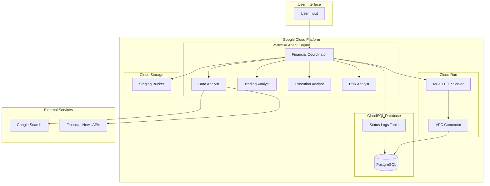
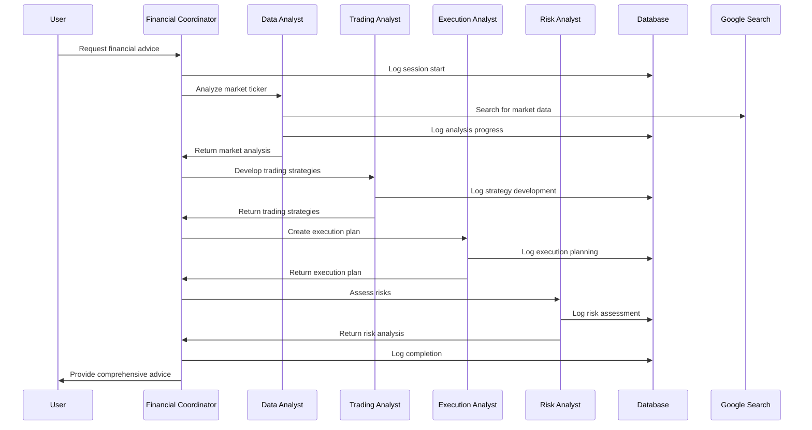
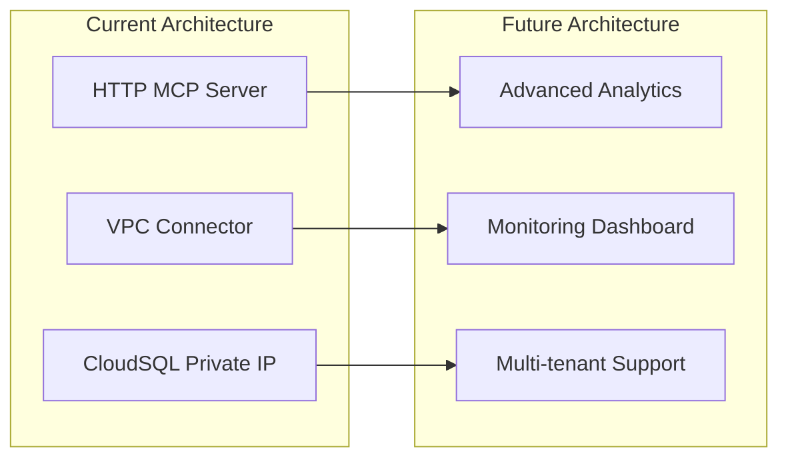

# Financial Advisor Architecture

## Overview

The Financial Advisor is a multi-agent AI system built on Google's Agent Development Kit (ADK) that provides comprehensive financial advice through a structured, step-by-step process. The system orchestrates specialized sub-agents to analyze market data, develop trading strategies, create execution plans, and assess risks.

## High-Level Architecture



## System Components

### 1. Core Agent Architecture

#### **Financial Coordinator (Root Agent)**
- **Purpose**: Orchestrates the entire financial advisory process
- **Model**: Gemini 2.5 Pro
- **Responsibilities**:
  - User interaction and guidance
  - Process coordination
  - Sub-agent orchestration
  - Status logging and monitoring

#### **Specialized Sub-Agents**

1. **Data Analyst**
   - **Purpose**: Comprehensive market data analysis
   - **Tools**: Google Search, Status Logger
   - **Output**: Market analysis report with SEC filings, news, sentiment

2. **Trading Analyst**
   - **Purpose**: Develop tailored trading strategies
   - **Input**: Market analysis, user risk profile, investment period
   - **Output**: Multiple trading strategies aligned with user preferences

3. **Execution Analyst**
   - **Purpose**: Create detailed execution plans
   - **Input**: Trading strategies, user preferences, broker information
   - **Output**: Specific execution instructions with timing and order types

4. **Risk Analyst**
   - **Purpose**: Comprehensive risk assessment
   - **Input**: All previous analysis and strategies
   - **Output**: Risk evaluation with mitigation strategies

### 2. Data Flow Architecture



### 3. Technology Stack

#### **Core Framework**
- **Google ADK**: Agent Development Kit for multi-agent orchestration
- **Vertex AI Agent Engine**: Managed agent hosting and execution
- **Gemini 2.5 Pro**: Large language model for agent reasoning

#### **Data Storage**
- **CloudSQL PostgreSQL**: Primary database for status logging
- **Google Cloud Storage**: Staging bucket for deployment artifacts

#### **External Integrations**
- **Google Search API**: Real-time market data and news
- **Financial News APIs**: Market sentiment and analysis

#### **Deployment & Infrastructure**
- **Google Cloud Platform**: Hosting and infrastructure
- **Cloud Run**: HTTP MCP server deployment with VPC connector
- **VPC Connector**: Secure private IP access to CloudSQL
- **Vertex AI**: Agent execution environment

### 4. Database Schema

#### **Status Logs Table**
```sql
CREATE TABLE agent_status_logs (
    id SERIAL PRIMARY KEY,
    timestamp TIMESTAMP DEFAULT CURRENT_TIMESTAMP,
    session_id VARCHAR(255),
    user_id VARCHAR(255),
    agent_name VARCHAR(100),
    status_type VARCHAR(50),
    message TEXT,
    metadata JSONB
);
```

**Purpose**: Track agent execution, performance monitoring, debugging, and analytics.

### 5. Agent Communication Patterns

#### **Synchronous Orchestration**
- Financial Coordinator directly calls sub-agents
- State passing through ADK's built-in state management
- Sequential execution with clear dependencies

#### **Status Logging**
- All agents log their progress to CloudSQL via HTTP API or direct connection
- HTTP MCP server provides scalable logging service on Cloud Run
- VPC connector ensures secure private IP access to CloudSQL
- Real-time monitoring of agent execution
- Error tracking and performance analytics

### 6. Deployment Architecture

#### **Local Development**
```bash
# Run locally with ADK
uv run adk run financial_advisor

# Test deployment
uv run deployment/test_deployment.py
```

#### **Cloud Deployment**
```bash
# Deploy to Vertex AI Agent Engine
uv run deployment/deploy.py --create

# Deploy MCP server to Cloud Run (optional)
uv run deployment/setup_vpc.py
uv run deployment/deploy_mcp_server.py

# Access deployed agent
uv run deployment/test_deployment.py
```

### 7. Security & Compliance

#### **Data Protection**
- Environment variables for sensitive configuration
- Secure database connections
- No hardcoded credentials

#### **Access Control**
- Google Cloud IAM for resource access
- CloudSQL authorized networks
- Secure agent-to-agent communication

### 8. Monitoring & Observability

#### **Status Logging**
- Real-time agent execution tracking
- Performance metrics collection
- Error monitoring and alerting

#### **Database Queries**
```sql
-- Recent agent activity
SELECT agent_name, status_type, message, timestamp 
FROM agent_status_logs 
ORDER BY timestamp DESC LIMIT 100;

-- Error tracking
SELECT * FROM agent_status_logs 
WHERE status_type = 'error' 
ORDER BY timestamp DESC;

-- Performance analysis
SELECT agent_name, COUNT(*) as execution_count,
       AVG(EXTRACT(EPOCH FROM (timestamp - LAG(timestamp) OVER (PARTITION BY session_id ORDER BY timestamp)))) as avg_processing_time
FROM agent_status_logs 
GROUP BY agent_name;
```

### 9. Scalability Considerations

#### **Horizontal Scaling**
- Multiple agent instances via Vertex AI
- CloudSQL connection pooling
- Stateless agent design

#### **Performance Optimization**
- Async database operations
- Efficient state management
- Caching for repeated queries

### 10. Future Enhancements

#### **Planned Features**
- **Advanced Analytics**: ML-based performance insights
- **Multi-tenant Support**: User-specific data isolation
- **API Integration**: RESTful endpoints for external access
- **Monitoring Dashboard**: Real-time agent performance visualization

#### **Architecture Evolution**


## File Structure

```
financial-advisor/
├── financial_advisor/           # Core agent implementation
│   ├── agent.py               # Financial coordinator
│   ├── prompt.py              # Main agent prompts
│   ├── sub_agents/            # Specialized agents
│   │   ├── data_analyst/      # Market data analysis
│   │   ├── trading_analyst/   # Strategy development
│   │   ├── execution_analyst/ # Execution planning
│   │   └── risk_analyst/      # Risk assessment
│   └── tools/                 # Custom tools
│       └── __init__.py        # Status logger tool
├── deployment/                 # Deployment scripts
│   ├── deploy.py             # Agent deployment
│   └── test_deployment.py    # Testing script
├── mcp_server/               # MCP server implementation
│   ├── server.py            # MCP server
│   ├── db_operations.py     # Database operations
│   └── config.py            # Configuration
├── tests/                    # Test suite
├── doc/                      # Documentation
└── pyproject.toml           # Dependencies
```

## Key Design Principles

1. **Modularity**: Each agent has a specific, well-defined responsibility
2. **Orchestration**: Central coordinator manages the overall process
3. **Observability**: Comprehensive logging and monitoring
4. **Scalability**: Cloud-native architecture for growth
5. **Security**: Secure by design with proper access controls
6. **Maintainability**: Clear separation of concerns and documentation

This architecture provides a robust foundation for financial advisory services while maintaining flexibility for future enhancements and scaling requirements.
